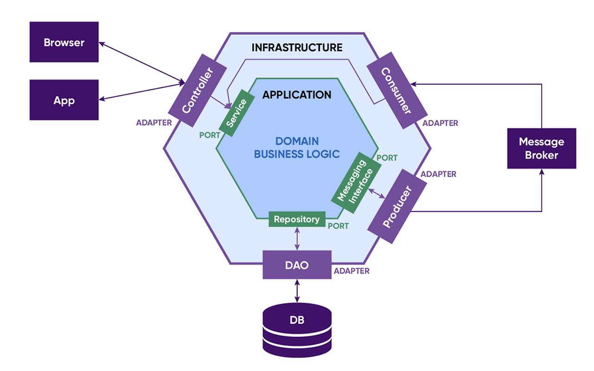

# Hexagonal Architecture basic

## 1. 헥사고날 아키텍처란?
헥사고날 아키텍처는 2005년 앨리스터 코오번(Alistait Cockburn)이 제안한 소프트웨어 설계 패턴으로, 포트와 어댑터(Ports and Adapters) 아키텍처라고도 불린다. 
핵심 아이디어는 애플리케이션의 핵심 로직(도메인)을 외부 세계와 완전히 분리하는 것이다.
가장 중요한 것은 의존성 방향이다. 모든 의존성은 바깥에서 안쪽(코어)을 향하며, 코어는 절대 바깥을 의존하지 않는다. 이를 위해 아웃바운드 포트는 코어가 인터페이스를 정의하고 어댑터가 이를 구현하는 의존성 역전(DIP)을 사용한다.




구성 요소
* 코어(Core / 도메인) : 순수한 비즈니스 로직으로, 외부 기술에 대해 아무것도 모른다. 육각형 안쪽에 위치한다. 
* 포트(Port) : 코어가 외부와 소통하기 위해 정의한 인터페이스이다
  * 인바운드 포트(driving/primary) : 외부에서 애플리케이션을 호출하는 통로 (ex. 유스케이스 인터페이스)
  * 아웃바운드 포트(driven/secondary) : 애플리케이션이 외부 자원을 필요로 할 때 쓰는 통로 (ex. 저장소 인터페이스)
* 어댑터(Adapter) : 포트를 실제 기술로 구현한 것 
  * 인바운드 어댑터 : REST 컨트롤러, CLI, 메시지 리스너 등
  * 아웃바운드 어댑터 : JPA 저장소 구현체, 외부 API 클라이언트 등

## 2. 장단점
장점
* 테스트 용이성 : 코어가 외부 기술에 의존하지 않으므로, 데이터베이스나 웹 서버 없이 비즈니스 로직만 단위 테스트할 수 있다. 
* 기술 교체의 유연성이 높음 : DB를 MySQL에서 PostgreSQL로, 통신을 REST에서 gRPC로 바꿔도 어댑터만 교체하면 되고 코어는 손대지 않는다. 
* 관심사의 명확한 분리 : 비즈니스 규칙과 인프라 코드가 섞이지 않아, 도메인 로직이 프레임워크 문법에 오염되지 않는다. 

단점
* 초기 복잡도와 보일러플레이트가 늘어남 : 포트 인터페이스, 어댑터 구현, 도메인 객체와 DTO 간 매핑 등 작성할 코드가 많아진다. 
* 러닝 커브 : 의존성 역전, 포트/어댑터 경계, 계층 규칙을 팀 전체가 이해하고 일관되게 지켜야 한다. 
* 과도한 추상화 위첨 : 실제로 교체할 일이 없는 대상까지 인터페이스로 감싸면, 얻는 것 없이 간접 계층만 일어난다. 

## 3. 예시 코드
패키지 구조
```
com.example.order
├── domain              # 순수 코어 — 프레임워크 의존 없음
│   ├── model           # Order, OrderLine, Money, OrderId ...
│   └── event           # OrderPlaced, OrderPaid ...
├── application
│   ├── port
│   │   ├── in          # PlaceOrderUseCase, PayOrderUseCase
│   │   └── out         # OrderRepository, EventPublisher
│   └── service         # OrderService
└── adapter
    ├── in.web          # OrderController
    └── out.persistence # OrderPersistenceAdapter, OrderJpaEntity
```

도메인 계층 (코어)
```kotlin
// Value Object — 불변, 값으로 동등성 판단
@JvmInline
value class OrderId(val value: UUID) {
    companion object { fun generate() = OrderId(UUID.randomUUID()) }
}

data class Money(val amount: BigDecimal, val currency: String = "KRW") {
    init { require(amount >= BigDecimal.ZERO) { "금액은 음수가 될 수 없다" } }
    operator fun plus(other: Money) = Money(amount + other.amount, currency)
}

data class OrderLine(val productId: ProductId, val quantity: Int, val price: Money) {
    init { require(quantity > 0) { "수량은 1 이상" } }
    val subtotal: Money get() = Money(price.amount * quantity.toBigDecimal())
}

enum class OrderStatus { CREATED, PAID, CANCELLED }
```
```kotlin
// Aggregate Root — 불변식(invariant)을 지키는 경계
class Order private constructor(
    val id: OrderId,
    val customerId: CustomerId,
    lines: List<OrderLine>,
    status: OrderStatus,
) {
    private val _lines = lines.toMutableList()
    val lines: List<OrderLine> get() = _lines.toList()

    var status: OrderStatus = status
        private set

    // 도메인 이벤트 수집
    private val _events = mutableListOf<DomainEvent>()
    val events: List<DomainEvent> get() = _events.toList()
    fun pullEvents(): List<DomainEvent> = _events.toList().also { _events.clear() }

    val totalPrice: Money
        get() = _lines.map { it.subtotal }.reduce(Money::plus)

    fun pay() {
        check(status == OrderStatus.CREATED) { "결제 가능한 상태가 아니다: $status" }
        status = OrderStatus.PAID
        _events += OrderPaid(id, totalPrice)   // 상태 변화 → 이벤트 발행
    }

    fun cancel() {
        check(status != OrderStatus.PAID) { "결제된 주문은 취소 불가" }
        status = OrderStatus.CANCELLED
        _events += OrderCancelled(id)
    }

    companion object {
        // 팩토리: 생성 시점의 불변식 보장
        fun place(customerId: CustomerId, lines: List<OrderLine>): Order {
            require(lines.isNotEmpty()) { "주문 항목이 최소 1개 필요" }
            return Order(OrderId.generate(), customerId, lines, OrderStatus.CREATED)
                .apply { _events += OrderPlaced(id, customerId) }
        }

        // 영속성에서 복원할 때 쓰는 재구성 팩토리 (이벤트 발행 안 함)
        fun reconstitute(id: OrderId, customerId: CustomerId,
                         lines: List<OrderLine>, status: OrderStatus) =
            Order(id, customerId, lines, status)
    }
}
```
```kotlin
// Domain Event
sealed interface DomainEvent { val occurredAt: Instant }
data class OrderPlaced(val orderId: OrderId, val customerId: CustomerId,
                       override val occurredAt: Instant = Instant.now()) : DomainEvent
data class OrderPaid(val orderId: OrderId, val total: Money,
                     override val occurredAt: Instant = Instant.now()) : DomainEvent
data class OrderCancelled(val orderId: OrderId,
                          override val occurredAt: Instant = Instant.now()) : DomainEvent
```

포트 (코어가 정의하는 인터페이스)
```kotlin
// 인바운드 포트 — 애플리케이션이 제공하는 유스케이스
interface PlaceOrderUseCase {
    fun place(command: PlaceOrderCommand): OrderId
}
interface PayOrderUseCase {
    fun pay(orderId: OrderId)
}

data class PlaceOrderCommand(val customerId: CustomerId, val items: List<OrderItemDto>)
data class OrderItemDto(val productId: ProductId, val quantity: Int, val price: Money)

// 아웃바운드 포트 — 코어가 필요로 하는 것
interface OrderRepository {
    fun save(order: Order)
    fun findById(id: OrderId): Order?
}
interface EventPublisher {
    fun publish(events: List<DomainEvent>)
}
```

애플리케이션 계층 (유스케이스 구현 = 오케스트레이션)
```kotlin
@Service
class OrderService(
    private val orderRepository: OrderRepository,   // 포트에만 의존
    private val eventPublisher: EventPublisher,
) : PlaceOrderUseCase, PayOrderUseCase {

    @Transactional
    override fun place(command: PlaceOrderCommand): OrderId {
        val lines = command.items.map { OrderLine(it.productId, it.quantity, it.price) }
        val order = Order.place(command.customerId, lines)   // 도메인이 규칙 담당

        orderRepository.save(order)
        eventPublisher.publish(order.pullEvents())
        return order.id
    }

    @Transactional
    override fun pay(orderId: OrderId) {
        val order = orderRepository.findById(orderId)
            ?: throw OrderNotFoundException(orderId)
        order.pay()
        orderRepository.save(order)
        eventPublisher.publish(order.pullEvents())
    }
}
```

어댑터 (바깥쪽 - 실제 기술)
```kotlin
// 인바운드 어댑터 — HTTP
@RestController
@RequestMapping("/orders")
class OrderController(
    private val placeOrder: PlaceOrderUseCase,
    private val payOrder: PayOrderUseCase,
) {
    @PostMapping
    fun place(@RequestBody req: PlaceOrderRequest): ResponseEntity<Map<String, String>> {
        val id = placeOrder.place(req.toCommand())
        return ResponseEntity.status(201).body(mapOf("orderId" to id.value.toString()))
    }

    @PostMapping("/{id}/payment")
    fun pay(@PathVariable id: UUID): ResponseEntity<Void> {
        payOrder.pay(OrderId(id))
        return ResponseEntity.noContent().build()
    }
}
```
```kotlin
// 아웃바운드 어댑터 — JPA (도메인 ↔ 엔티티 매핑을 여기서 격리)
@Entity @Table(name = "orders")
class OrderJpaEntity(
    @Id val id: UUID,
    val customerId: UUID,
    @Enumerated(EnumType.STRING) var status: OrderStatus,
    @OneToMany(cascade = [CascadeType.ALL], orphanRemoval = true)
    @JoinColumn(name = "order_id")
    val lines: MutableList<OrderLineJpaEntity>,
)

@Repository
class OrderPersistenceAdapter(
    private val jpaRepository: OrderJpaRepository,
) : OrderRepository {

    override fun save(order: Order) {
        jpaRepository.save(order.toJpaEntity())   // 도메인 → 엔티티
    }

    override fun findById(id: OrderId): Order? =
        jpaRepository.findById(id.value).orElse(null)?.toDomain()  // 엔티티 → 도메인
}
```

### 추가로 읽어본 블로그
* https://devblog.kakaostyle.com/ko/2025-03-21-1-domain-driven-hexagonal-architecture-by-example/
* https://tech.kakaopay.com/post/home-hexagonal-architecture/